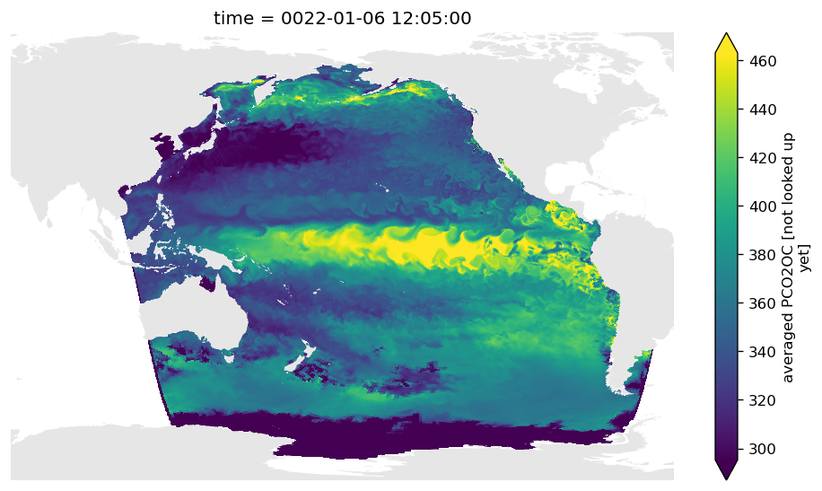
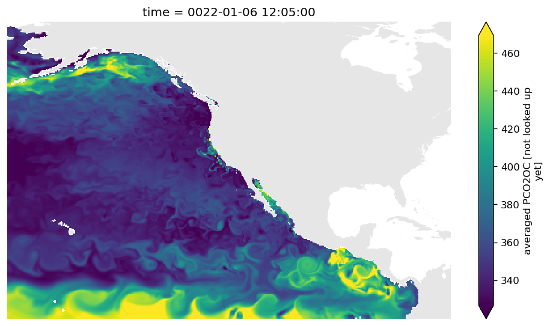
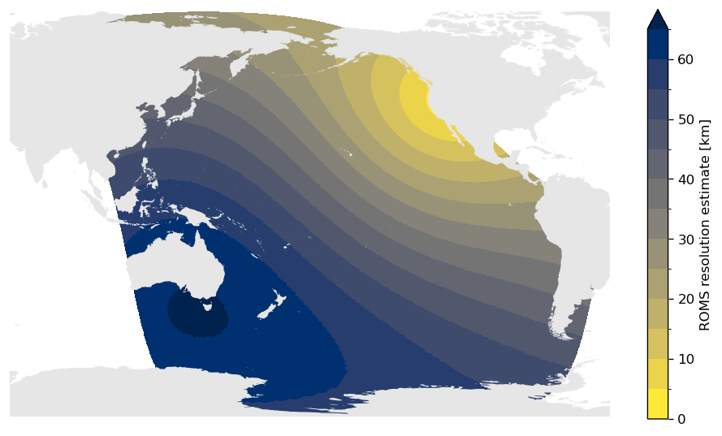

# ROMS regrid

A lightweight package to regrid ROMS data

Quick overview

- `read_data_sources` -> catalog: reads data_sources.yaml that contains info to load ROMS data
- `ROMSLoader(catalog.entry)` -> loader(year) -> ds_roms
- `ROMSRegridder(ds, res_out, bbox_out=[W,S,E,N])` -> regridder(ds_roms) -> ds_regridded
- `plot_map(ds_roms.pco2sea)` -> fig, axs, img 


## Usage

### Setting up the package
```python
from src import regrid_roms as rr

# setting up the data sources is critical! 
# have a look at how I've done this 
catalog = rr.read_data_sources('./data_sources.yaml')
```

### Loading data
```python
# here we give the ROMSLoader a dictionary that contains all the required info loaded from the yaml file
pactcs30_loader = rr.ROMSLoader(catalog.ROMS_pactcs30_hc006)
ds_1979 = pactcs30_loader(0)  # load the first file in the time series
# OR
ds_2000 = pactcs30_loader(2000)  # load the year

# we can have a look at the data in the native reoslution
fig, axs, img = rr.plot_map(ds_2000.pco2sea[0])
```


    
### Regridding data
```python
# create a regridder using xESMF - this will store the weights for faster computation later
pactcs30_regridder = rr.ROMSRegridder(
    ds_in=ds_1979,  # the input file (only done once per model and can be reused for different years from that model)
    res_out=0.25,  # resolution in degrees of the output
    bbox_out=[-170, 0, -70, 67],  # this is the output area W, S, E, N
)

# to regrid a dataset or dataArray, simply pass the file to the regridder
out = pactcs30_regridder(
    ds_roms=ds_2000.pco2sea[0], 
    compute=True,  # if False, then returns dask obj, else computs with progressbar
)

# I've also created a quick function to plot a map
fig, axs, img = rr.plot_map(out)
```


    

    

### Getting ROMS resolution 
```python
# we can have a quick look at the resolution of the output - I have not checked that this works
ax = pactcs30_regridder.estimate_resolution(return_plot=True, regridded=False)
```


    
